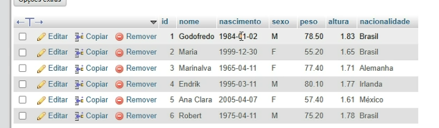

# Como criar um banco de dados

## Criar Banco

Para criação de banco de dados usar o comando a baixo.

```
CREATE DATABASE CADASTRO;
```

- Pode ser criado por comando no console, dando um Control + Enter.

## Criação da Tabela.

Criar a primeira tabela, e conceitos do comandos

```sql
CREATE TABLE PESSOAS(
    NOME VARCHAR(30),
    IDADE TINYINT(3),
    SEXO CHAR(1),
    PESO FLOAT,
    ALTURA FLOAT,
    NACIONALIDADE VARCHAR(20)
);
```
- Para ver a descrição databela.

```sql
DESCRIBE pessoas;
DESC PESSOAS;
```

- Usado para selecionar as informações da tabela selecionada.

```sql
SELECT * FROM PESSOAS;
```

- Usando o comando para deletar a tabela.

```sql
DROP TABLE PESSOAS;
```

- Usando o Drop para deletar o banco de dados.

```sql
DROP DATABASE CADASTRO
```

## Adicinando Banco com Configuração

Para adicionar um banco com um configuração padrão, de acentuação

```sql
CREATE DATABASE BANCOCONFIGURADO
DEFAULT CHARACTER SET utf8
DEFAULT COLLATE utf8_general_ci;
```
## Criação de tabela

```sql
CREATE TABLE PESSOAS(
    NOME VARCHAR(30) NOT NULL, 
    NASCIMENTO DATE, 
    SEXO ENUM('M', 'F'), 
    PESO DECIMAL(5,2), 
    ALTURA DECIMAL(3,2), 
    NACIONALIDADE VARCHAR(20) DEFAULT 'BRASIL' 
); DEFAUL CHARSET = utf8;
```

## Tipos de Dados

Tipos de dados para (String) armazenamento das informações.

- CHAR: Armazena string de tamanho fixo.
- VARCHAR: Para strings de tamanho variável, utilizando apanas o espaço necessário para os dados.
- TEXT: Para textos mais longos de comprimento variável, com um limite maior que o VARCHAR
- BLOB: Para armazenamento de várias informações, com campos grandes.

### Tipos numericos

São Usados para armazenar números.

- INT (integer): Para número inteiros, positivos ou negativos.
- BIGINT: Para números inteiros maiores que o INT.
- DECIMAL ou NUMERIC: Para números decimais com precisão fixa, ideais para valores monetários, pois garentem exatidão.
- FLOAT e DOUBLE: para número de ponto flutuante com precisão simple e fupla, respectivamente, que representam números com fraçaões, mas podem não ser exatos.

01. float - precisão simples 32 bites (4bytes)
02. double - precisao dupla 64 bitys (8 bytes)

### tipos de Dados data e Hora

Para armazenar informações de tempo.

- DATA: Armazena datas no formato "AAAA-MM-DD".
- TIME: Armazena horários no formato "hh:mm:ss".
- DATATIME: Combina data e hora no formato "AAAA-MM-DD HH:MM:SS".
- TIMESTAMP: Semelhante ao DATETIME, mas armazena a data e hora como o número de segundos passados desde uma data de referência, o que o torna útil para registrar o momento de criação ou atualização de um registro.
- YEAR: Para armazenar o ano com quatro dígitos no formato "AAAA".

### Tipo de dados 

Outro Tipos

- ENUM: Permite definir uma lista de valores permitidos para uma coluna, funcionando como uma lista de operações restritas.
- Espacial: Para armazenar dados geométricos, como pontos em uma superfície geográficas.
- JSON: Para armazenar documentos em formato JSON (JavaScript Object Notation).

## Exercícios 01

Requistidos 

- Crie um banco de dados chamando escola.
- Selecione o bando de dados escola.
- Crie  um tabela chamada alunos com os seguintes campo:
```
id -> inteiro, chave
primaria, auto-increment
nome -> varchar(50)
idade -> tinynit
curso -> varcahr(30)
```

Resolução:

```sql
CREATE DATABASE ESCOLA
DEFAULT CHARACTER SET utf8
DEFAULT COLLATE utf8_general_ci;

CREATE TABLE ALUNOS(
    ID_ALUNOS INT AUTO_INCREMENT PRIMARY KEY,
    ALUNOS_NOME VARCHAR(50),
    ALUNOS_IDADE TINYINT,
    ALUNOS_CURSO VARCHAR(30)
)
```

## Exercícios 02

Requisitos

- Insira 5 Alunos na tabela de alnos com nomes, idades e curso diferentes.
- Exibir todos os da tableas.
- Exiba apenas os nomes e idades do alunos.
- Exbi apenas os alunos que tem maior que 18 anos.

### para inserir
```sql
INSERT INTO ALUNOS (ALUNOS_NOME, ALUNOS_IDADE, ALUNOS_CURSO) VALUES ("Emerson", 37, "Desenvolvedor Front End");
INSERT INTO ALUNOS (ALUNOS_NOME, ALUNOS_IDADE, ALUNOS_CURSO) VALUES ("Eduardo", 11, "Estudante");
INSERT INTO ALUNOS (ALUNOS_NOME, ALUNOS_IDADE, ALUNOS_CURSO) VALUES ("Kadu", 8, "Estudante");
INSERT INTO ALUNOS (ALUNOS_NOME, ALUNOS_IDADE, ALUNOS_CURSO) VALUES ("Karina", 36, "Corte e Costura");

INSERT INTO ALUNOS (ALUNOS_NOME, ALUNOS_IDADE, ALUNOS_CURSO) VALUES ("Emerson", 37, "Desenvolvedor Front End"),
("Luzia", 61, "Curos de Propaganda"),
("Gabriel", 41,"Curso de Corretor")
```

Para selecionar

- Exibir todos da tabela
```sql
SELECT * FROM ALUNOS
```

- Exiba apenas os nomes e idades do alunos
```sql
SELECT ALUNOS_NOME, ALUNOS_IDADE FROM ALUNOS
```

- Exbi apenas os alunos que tem maior que 18 anos
```sql
SELECT * FROM ALUNOS WHERE ALUNOS_IDADE >= 18
```

## Para Adiconionar uma coluna Tebela

Para Adicionar um coluna

```sql
ALTER TABLE PESSOA ADD COLUMM PROFISSAO VARCHAR(10);
```

## Para Deletar uma coluna Tebela

Para Deletar um coluna

```sql
ALTER TABLE PESSOA DROP COLUMM PROFISSAO VARCHAR(10);
```

## Para Adiconionar uma coluna do lado na Tebela

Para Adicionar um coluna do lado de uma oputra coluna existente

```sql
ALTER TABLE PESSOA ADD COLUMM PROFISSAO VARCHAR(10) AFTER NOME;
```
Para Adicionar um coluna por primeiro
```sql
ALTER TABLE PESSOA ADD COLUMM CODIGO INT FIRST;
```


## Exemplos
```sql
CREATE TABLE PESSOA(
    NOME VARCHAR(30) NOT NULL, 
    NASCIMENTO DATE, 
    SEXO ENUM('M', 'F'), 
    PESO DECIMAL(5,2), 
    ALTURA DECIMAL(3,2), 
    NACIONALIDADE VARCHAR(20) DEFAULT 'BRASIL' 
); DEFAUL CHARSET = utf8;
```

```sql
INSERT INTO PESSOA (NOME, NASCIMENTO, SEXO, PESO, ALTURA, NACIONALIDADE) VALUES 
('Godofredo', '1984-01-02', 'M', 78.50, 1.83, 'Brasil'),
('Maria', '1999-12-30', 'F', 55.20, 1.65, 'Alemanha'),
('Marinalva', '1965-04-11','F', 77.40, 1.71, 'Brasil'),
('Endrik', '1995-03-11', 'M', 80.10, 1.77, 'Portugal'),
('Ana Clara', '2005-04-07', 'F', 57.40, 1.61, 'Brasil')
('Robert', '1975-04-11', 'M', 75.20, 1.78, 'Brasil')
```

